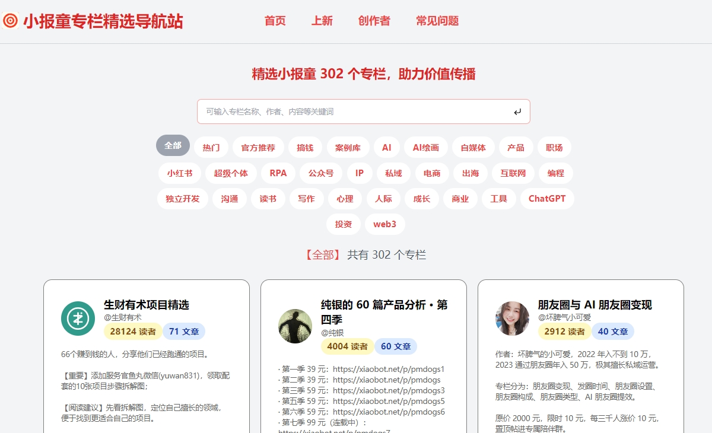

# 小报童专栏精选导航站



目前精选收录了 591 个小报童专栏，涵盖了各个领域的专栏，包括副业、AI、ChatGPT、AI绘画、自媒体、产品、职场、小红书、RPA、公众号、搞钱、IP、私域、电商、出海、互联网、编程、独立开发、沟通、读书、写作、心理、人际关系、成长、商业、工具、投资、web3等。


## 本地使用

```
git clone https://github.com/nivance/xiaobaotong-choice.git

cd xiaobot-choice

npm install

npm run dev
```

通过浏览器访问 http://localhost:3000

## Vercel部署

[](https://vercel.com/import/project?template=https://github.com/nivance/xiaobot-choice)